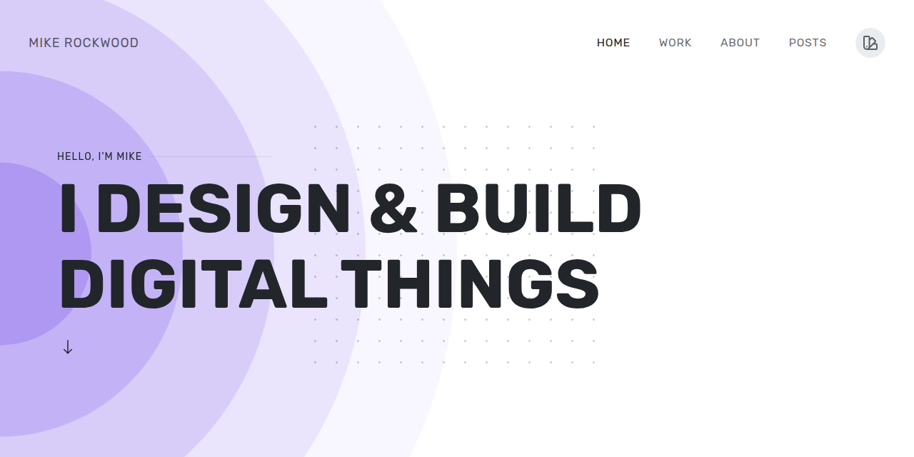

# mikerockwood.com

Personal site, portfolio, blog, and assorted internet debris.

The site is built with [Zola](https://www.getzola.org/), styled with [UIkit](https://getuikit.com/), and published as a static site.



## Requirements

- [Zola](https://www.getzola.org/), using the version in [`ZOLA_VERSION`](ZOLA_VERSION)
- GNU Make

Zola can be installed with your operating system's package manager or from the [official releases](https://github.com/getzola/zola/releases). The Makefile checks the version before running. If Zola is installed somewhere unusual, point Make at it:

```sh
make ZOLA=/path/to/zola serve
```

## Local development

```sh
# Start a draft-enabled server and open it in a browser
make serve

# Build the production site
make build

# Check templates and content
make check

# Check the local Zola installation
make doctor
```

The generated site goes into `public/`.

## Project layout

```text
content/     Pages, posts, documentation, and work history
sass/        UIkit Sass and site-specific styles
static/      Fonts, images, JavaScript, CMS files, and other static assets
templates/   Zola templates, components, and shortcodes
config.toml  Site and author configuration
Makefile     Local development commands
```

## Content

The main sections are:

- `content/pages/` for evergreen pages like About, Uses, and Colophon
- `content/posts/` for the publishing stream
- `content/work/` for portfolio projects

Posts are organized by type, including articles, bookmarks, jams, likes, notes, photos, replies, reposts, RSVPs, and videos. Most content is written in Markdown with YAML front matter.

### Front matter naming

Zola's built-in fields keep Zola's spelling, such as `sort_by` and `page_template`. Site-specific fields use kebab-case, such as `featured-image`, `external-link`, and `bookmark-of`. Simple one-word fields stay lowercase, such as `service`, `thumbnail`, and `id`.

## Publishing

The site is deployed to GitHub Pages through GitHub Actions. The CMS lives at `/admin/` and uses [Sveltia CMS](https://github.com/sveltia/sveltia-cms).

The site also includes IndieWeb features such as microformats, Atom feeds, and Webmention support. Social profile links and author details live in `config.toml`.

## Useful files

- `config.toml` controls site metadata, menus, taxonomies, and author information
- `templates/base.html` defines the shared page shell
- `templates/posts/` contains post-type layouts
- `templates/components/` contains reusable Tera components
- `templates/partials/` contains reusable template fragments
- `templates/shortcodes/` contains Markdown shortcodes
- `sass/style.scss` is the main stylesheet entry point
- `.github/workflows/` contains build, deployment, and Webmention automation

## License

Unless noted otherwise, the content and design belong to Mike Rockwood. Third-party images, fonts, libraries, and other assets retain their original licenses.
